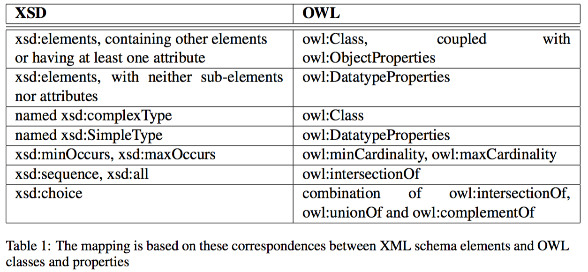

# XML Schema to OWL Ontology

## Source
* XSD file
* e.g.: UANodeSet.xsd (http://opcfoundation.org/UA/2011/03/UANodeSet.xsd)
	* xmlns="http://opcfoundation.org/UA/2011/03/UANodeSet.xsd"
	* xmlns:xs="http://www.w3.org/2001/XMLSchema"
* e.g.: Types.xsd (http://opcfoundation.org/UA/2008/02/Types.xsd)

## Process
* parsing, transformation, serialization
* It creates a model of an ontology from the given XML schema.  
= terminological knowledge
* The created ontology has a namespace which can be refered by instances ontology.

### Parsing
####1. XSOMParser (Java)
Read schema file and generate `schemaset` and `schema` using 

	// Package: com.sun.xml.xsom
	
	XSOMParser parser = new XSOMParser(SAXParserFactory.newInstance());
	parser.setAnnotationParser(new AnnotationFactory());
	parser.parse(file);
	XSSchemaSet schemaSet = parser.getResult();
	XSSchema schema = schemaSet.getSchema(1);
reference: [Class XSOMParser](https://xsom.java.net/nonav/javadoc/com/sun/xml/xsom/parser/XSOMParser.html)

####2. lxml (Python)
http://lxml.de/index.html

####3. node-opcua (nodejs)

### Transformation
Transformation rule applied

####1. General Rules
* We assume the XML documents to contain relational structures
* With OWL on the top of RDF and RDFS, restrictions, such as cardinality constraints on properties, can be expressed
* **elements**: XML Schema’s main modeling primitives are elements. Elements may be simple, composed or mixed. Simple elements have as their contents datatypes, like string or integer. Composed elements have as contents other (child) elements. Also they define a grammar that defines how they are composed from their child elements. Finally, mixed elements can mix strings with child elements. In addition, elements may have attributes.
* **grammar**: XML Schema allows the definition of stronger requirements via a grammar: sequence and choice of attributes applied to an instance can be defined.
* **type-derivation**: First, in XML Schema all inheritance has to be modeled explicitly. Second, XML Schema does not provide a direct way to inherit from multiple parents. Types can only be derived from one basetype. Third, and very important, the is-a relationship has a twofold role in conceptual modeling which is not directly covered by XML Schema:
	* Top-down inheritance of attributes from superclasses to subclasses. Assume employee as a subclass of a class person. Then employee inherits all attributes that are defined for person.
	* Bottom-up inheritance of instances from subclasses to superclasses. Assume employee as a subclass of a class person. Then person inherits all instances (i.e., elements) that are an element of employee.
* **namespaces**: XML Schema has a relative simple inclusion mechanism that is based on XML namespaces.

* handling nested tags
	* considered representing a **”part-of”** relationship or they express a **”subtype-of”** relationship
* For nested elements
	* one element contains another element, which contains not only a literal, we assume a **”part-of”** relationship, 1:N relationship. This is mapped to an **owl:ObjectProperty**, which establishes a relationship between two classes.
	* **”subtype-of”** relations, i.e. we link together named xsd:complexTypes and therefrom derived elements.
* Classes (owl:Class)
	* from **xsd:complexTypes** and **xsd:elements**
	* an element in the source XML tree is always a leaf, containing only a literal and no attributes, this element will be mapped to an **owl:DatatypeProperty** having as domain the class representing the surrounding element
	* **XML attributes** are mapped to **owl:DatatypeProperties**
		* assume them representing database columns.
* XML Schema also can contain arity constraints like **xsd:minOccurs or xsd:maxOccurs**, which we map to the equivalent cardinality constraints in OWL, **owl:minCardinality and owl:maxCardinality**. 

* if an **xsd:element contains literal content as well as at least one xsd:attribute**. The xsd:element becomes an **OWL class**, the xsd:attribute is mapped to a **datatype property** and the literal content will be stored in the additional OWL **datatype property**.

#### Conversion Rule
XSD tag | Type | Remark
------------- | ------------- | -------------
xs:simpleType | rdfs:Datatype with the suffix “Datatype” on datatype name. |
xs:simpleType with xs:enumeration | rdfs:Datatype with the suffix “Datatype” on datatype name.In addition, for the enumerations, an owl:Class as a subclass of EnumeratedValue is created. Instances are created for every enumerated value. An instance of Enumeration, referring to all the instances, is created as well as the owl:oneOf union over the instances. These are mostly informative, as they are not used directly during the XML data to RDF/OWL transformation.
xs:complexType over xs:complexContent |	owl:Class
xs:complexType over xs:simpleContent	| owl:Class
xs:element (global) with complex type	| owl:Class and subclass of the class generated from the referenced complex type
xs:element (global) with simple type	| owl:Datatype
xs:element (local to a type)	| owl:DatatypeProperty or owl:ObjectProperty depending on the element type. OWL Restrictions are built for the occurrence.
xs:group	| owl:Class
xs:attributeGroup	| owl:Class
Anonymous Complex Type	| As for Complex Type except a URI is constructed as Anon _ #. Also, the class is defined as a subclass of Anon.
Anonymous Simple Type	| As for Simple Type except a URI is constructed as Anon_ #.
Substitution Groups	| Subclass statements are generated for the members.
xsi:type on an XML element	| Overrides the schema abstract type with the specified type.

### Serialization

